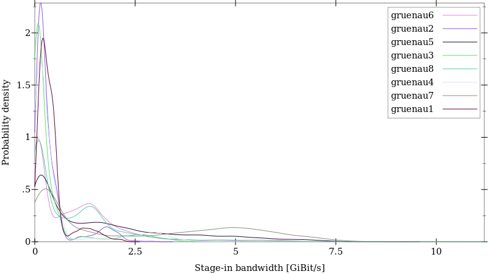

# Cuneiform Plotting Library

This library visualizes Cuneiform history logs. These logs can be collected by connecting to a common runtime environment (CRE) via `localhost:4142/history.json`.

## Usage

### Building the cfplot Command Line Tool

A binary can be created by entering

    raco make -j 8 *.rkt
    raco exe cfplot.rkt

The resulting file `cfplot` provides a command line interface to the plotting library.

### Using cfplot

    cfplot my-history-file.json

## Graph Types

### Dependency Graph

*Complete variant call dependency graph*

*Detail of the variant call dependency graph*

### Worker Allocation Graph

### Staging Bandwidth over Time Scatter Plot

### Staging Bandwidth Density

### Stage-in Bandwidth Density per Compute Node

### Stage-out Bandwidth Density per Compute Node

### Processing Throughput Scatter Plot

### Processing Throughput Density

### Processing Throughput Density per Compute Node

### Processing Selectivity Scatter Plot

